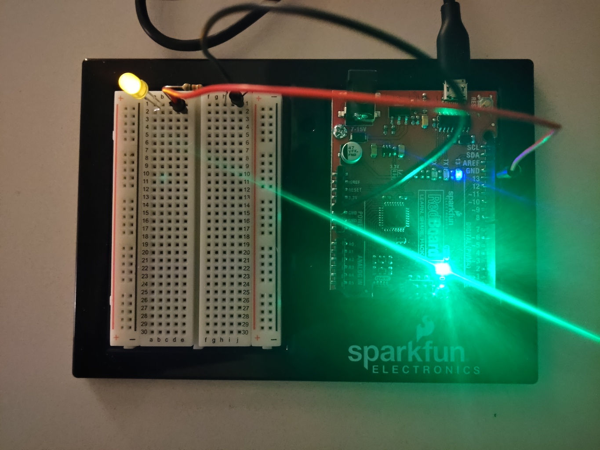

Implementation of circuit 1A from the Sparkfun Inventors Kit (SIK). Their original source code can be found at the [SparkFun Git Repo](https://github.com/sparkfun/SIK-Guide-Code).

The setup of the circuit follows:
* LED (colour doesn't matter) connected to D13 (digital pin 13), this is the same as the onboard LED of the RedBoard, so both will flash.
* A 350 ohm resistor from between the LED ground

I tend to put my resistors on the ground side of the LED, but in the book it is connected on the positive side. So my final circuit is as follows:

D13 -> LED+ -> 350 ohm resistor -> ground

![Wiring Photo][1]

[1]: doc/1ACircuitWiring.jpg "Circuit Wiring"

The first experiment was to see at what value in milliseconds in `delay(ms)` would create a noticeable in the LED. The external LED had a noticeable flicker at approximately 10 ms and the onboard LED at approximately 13 ms.

The next experiment, I wanted to investigate dimming of the LED. This is accomplished by rapidly turning it on and off but attempting to show no or very little flickering. The best results was using the microseconds and tuning the LED on for a minimum amount of time or anything less than 50us, which seemed to be the lowest delta, and the off for the maximum time without showing any flicker, which was around 10000us (or 10 ms).

In the photo (click photo to view video), the green LED is the power LED at full power. It should be noticed the blue onboard LED appears dimmer. The yellow LED in the photo appear brigher in the picture than in person.
 