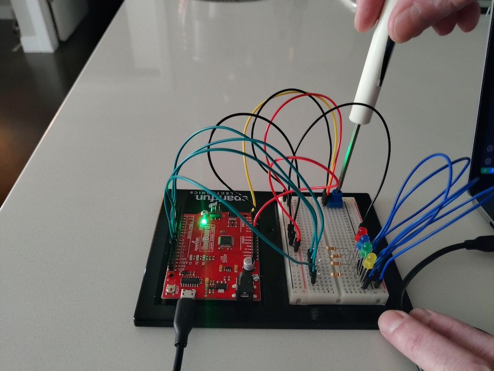

Implementation of circuit 1B from the Sparkfun Inventors Kit (SIK). Their original source code can be found at the [SparkFun Git Repo](https://github.com/sparkfun/SIK-Guide-Code).
View circuit diagram and instructions at: https://learn.sparkfun.com/tutorials/sparkfun-inventors-kit-experiment-guide---v41/circuit-1b-potentiometer

The setup of the first circuit:
The setup of the circuit:
* LED (colour doesn't matter) connected to D13 (digital pin 13), this is the same as the onboard LED of the RedBoard, so both will flash.
* A 350 ohm resistor from between the LED ground
* Potentiometer is installed on board with 5v power to the 3rd pin and ground connected to 1st pin
* Potentiometer centre pin is connected to Analog 0 (A0)

![Initial Wiring Photo][1]

[1]: doc/1B_CircuitWiring.jpg "1B Initial Circuit Wiring"

The experiment was to connect the value of the potentiometer (pot) to the value in the `delay(ms)` to control the rate the LED flashes based on the pot's setting. The first run included the code from the [SparkFun git repo](https://github.com/sparkfun/SIK-Guide-Code/blob/master/SIK_Circuit_1B-Potentiometer/SIK_Circuit_1B-Potentiometer.ino) moved into the PlatformIO format.

My first modification was to incorporate the use of classes and timer: LED, Timer, Potentiometer, Writer. The LED's time delay was bound to the value by both class accessing a raw pointer. The Writer class was modified to print to `Serial` by multiple Printer implementation through an array of pointers. The next modification was to include a number of `#ifdef` statements and use the `platformio.ini` and `build_flags` ([See PlatformIO doc](https://docs.platformio.org/en/latest/projectconf/section_env_build.html?highlight=build%20flags#build-flags)). This format allows for the inclusion of multiple experiments in the `main.cpp` file. 

The next experiment was to apply some sort of change, or mutation of the pot's value to exert additional control over the LED. For this I decided to do something similar to the dimming in the circuit 1A experiment. The value was still bound the the LED; however, the on cycle was set to 20us and the pot value was scaled by a factor of 10. This would have the off cycle from 0us to 10240us allowing for reasonable dimming control.

The final experiment included the use of additional LEDs with the rest of the circuit remaining the same. The new LEDs were wired to analog pins 12, 11, and 10.

![Modified Wiring Photo][2]

[2]: doc/1B_CircuitWiringExercises.jpg "1B Modified Circuit Wiring"

The new LEDs were set as follows:
* A13 - Flashing with delay increasing as voltage on pot increases
* A12 - Dimming with brightness increasing as voltage on pot increases
* A11 - Dimming with brightness decreasing as voltage on pot increases
* A10 - Flashing with delay decreasing as voltage on pot increases

The following video shows the results of all modified experiments from, flashing then dimming then multi LED.

