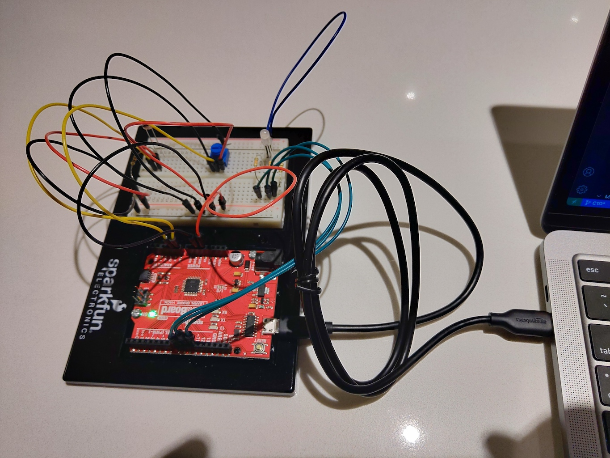

Implementation of circuit 1B from the Sparkfun Inventors Kit (SIK). Their original source code can be found at the [SparkFun Git Repo](https://github.com/sparkfun/SIK-Guide-Code).
View circuit diagram and instructions at: https://learn.sparkfun.com/tutorials/sparkfun-inventors-kit-experiment-guide---v41/circuit-1d-rgb-night-light

The setup for the experiments:
* RGB LED connected to PWM ports on RedBoard
* Analog 9 to 350 ohm resistor to RGB LED red lead 
* Analog 10 to 350 ohm resistor to RGB LED green lead
* Analog 11 to 350 ohm resistor to RGB LED blue lead
* Photoresistor is connected to 5v power (either pin)
* A 10k ohm resister is on the other lead of the photoresistor to the ground
* The negative (ground side) is also wired to analog 0 (A0)
* Potentiometer is installed on board with 5v power to the 3rd pin and ground connected to 1st pin
* Potentiometer centre pin is connected to Analog 1 (A1)

![Wiring Photo][1]

[1]: doc/1D_CircuitWiring.jpg "1D Circuit Wiring"

### Default
Conversion of the Sparkfun code into PlatformIO to test the circuit wiring. This was uploaded and tested; however, wasn't included in the video.

### Experiment 1 - Add more colours
A number of additional colours were added. The original sketch included eight colours and the this added additional colours to a total of 17. The first colour (0) is black, or off. Therefore, there is a total of 16 colours. In the video, there doesn't appear to be great contrast between the colours.

### Experiment 2 - Flash colours
This experiment flashes the LED cycling through the 16 colours on each flash.

### Experiment 3 - Adjustable threshold
This experiment uses the potentiometer to adjust the threshold for the amount of ambient light is required to switch the LED on.

### Experiment 4 - Smooth cycle
This experiment cycle through colours on the LED attempting to use a smooth transition between colours. This experiment uses a subset of 7 colours when cycling.

