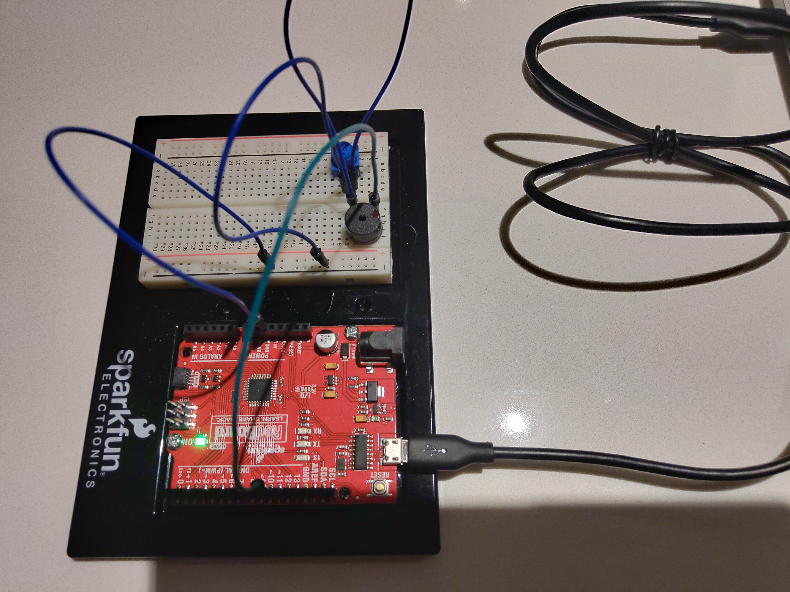

Implementation of circuit 2A from the Sparkfun Inventors Kit (SIK). Their original source code can be found at the [SparkFun Git Repo](https://github.com/sparkfun/SIK-Guide-Code/tree/master/SIK_Circuit_2A-Buzzer).
View circuit diagram and instructions at: https://learn.sparkfun.com/tutorials/sparkfun-inventors-kit-experiment-guide---v41/circuit-2a-buzzer

The setup for the experiments:
* The positive lead of the buzzer is connected to Analog PWM pin 10
* The negative lead is connected to one end of the potentiometer 
* The centre pin of the potentiometer is connected to ground

![Wiring Photo][1]

[1]: doc/2A_CircuitWiring.jpg "2A Circuit Wiring"

### Default
Conversion of the Sparkfun code into PlatformIO to test the circuit wiring. This was uploaded and tested.

### Experiment 1
A new song was added 'O-Canada'. The music score was taken from the [Wikipedia Page](https://en.wikipedia.org/wiki/O_Canada). The code was implemented C style without a lot of fluff from the previous exercises. A number of structs were created to store song and other information used by the play method. The original score is in a different key than the notes, so no flats or sharps are included.

### Experiment 2
This experiment uses the same code as experiment 1, but plays around with some song tempo. On the 57th "note" the tempo is speeded up. It is speeded up again on the 77th "note".

Here is the video... unlike previous videos, this one does include audio.

