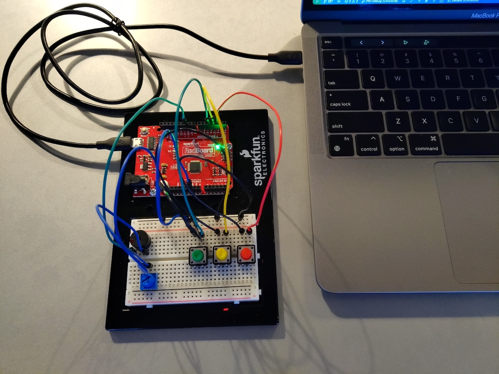

Implementation of circuit 2B from the Sparkfun Inventors Kit (SIK). Their original source code can be found at the [SparkFun Git Repo](https://github.com/sparkfun/SIK-Guide-Code/blob/master/SIK_Circuit_2B-DigitalTrumpet).
View circuit diagram and instructions at: https://learn.sparkfun.com/tutorials/sparkfun-inventors-kit-experiment-guide---v41/circuit-2b-digital-trumpet

The setup for the experiments:
* The positive lead of the buzzer is connected to Analog PWM pin 10
* The negative lead is connected to one end of the potentiometer 
* The centre pin of the potentiometer is connected to ground
* The red button connected to Analog 2 (A2)
* The yellow button connected to Analog 3 (A3)
* The green button connected to Analog 4 (A4)

![Wiring Photo][1]

[1]: doc/2B_CircuitWiring.jpg "2B Circuit Wiring"

### Default
Conversion of the Sparkfun code into PlatformIO to test the circuit wiring. This was uploaded and tested. (not included in video)

### Experiment 1
Experiment 1 converted the supplied code into C codes styles and used some `structs` and function parameters to play the notes. The notes were pulled from the previous circuit and assigned to the buttons. On inspection, I did find I messed up on the note frequencies in the 2A experiments, so the notes array was fixed. I did push the fix to the previous experiments, but did not redo the video, so O Canada still sounds off in the previous video. But in this experiment, each button is assigned a single note.

### Experiment 2
Experiment 2 assigns notes to button press combinations. So each button will play a note, but when multiple buttons are press, they play different notes. This uses an `if` statement to determine what note to press and the press state is updated for that button. The button state is compared and a note is played based on the buttons pressed.

### Experiment 3
Experiment 3 is the same as experiment 2 except the press state is not used. Instead a flag variable is updated with a mask to determine which buttons are pressed. This flag is then used in a switch statement to play the appropriate note. An alternate method could be to create an array of notes and index the notes based on the flag variable.

Here is the video with audio.

