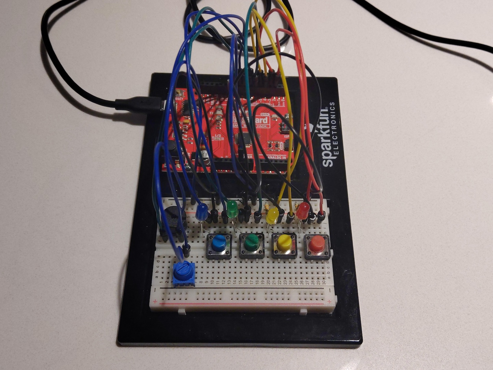

Implementation of circuit 2A from the Sparkfun Inventors Kit (SIK). Their original source code can be found at the [SparkFun Git Repo](https://github.com/sparkfun/SIK-Guide-Code/tree/master/SIK_Circuit_2C-SimonSays).
View circuit diagram and instructions at: https://learn.sparkfun.com/tutorials/sparkfun-inventors-kit-experiment-guide---v41/circuit-2c-simon-says-game

The setup for the experiments:
* The positive lead of the buzzer is connected to Analog PWM pin 10
* The negative lead is connected to one end of the potentiometer 
* The centre pin of the potentiometer is connected to ground
* The red button connected to Analog 2 (A2)
* The yellow button connected to Analog 4 (A4)
* The green button connected to Analog 6 (A6)
* The blue button is connected to Analog 8 (A8)
* The red LED is connected to Analog 3 (A3)
* The yellow LED is connected to Analog 5 (A5)
* The green LED is connected to Analog 7 (A7)
* The Blue LED is connected to Analog 9 (A9)

![Wiring Photo][1]

[1]: doc/2C_CircuitWiring.jpg "2C Circuit Wiring"

### Default
Conversion of the Sparkfun code into PlatformIO to test the circuit wiring. This was uploaded and tested. (not included in video)

### Experiment 1
Experiment 1 converted the supplied code into C header files and used a number of `structs` to store some values. It was moved into a state pattern which used a function variable to operate the game. Much more complicated than the original code, but it more about experimenting than anything. The songs were changed and some of the game values updated to make it a bit more challenging. It also flashes periodically when waiting to start a new game. However, it generally plays the same as the original game.

### Experiment 2
Experiment 2 changed the game into two player head-to-head mode. Each player has their own sequence and then take turns progressing through the rounds.

Here is the video with audio.

