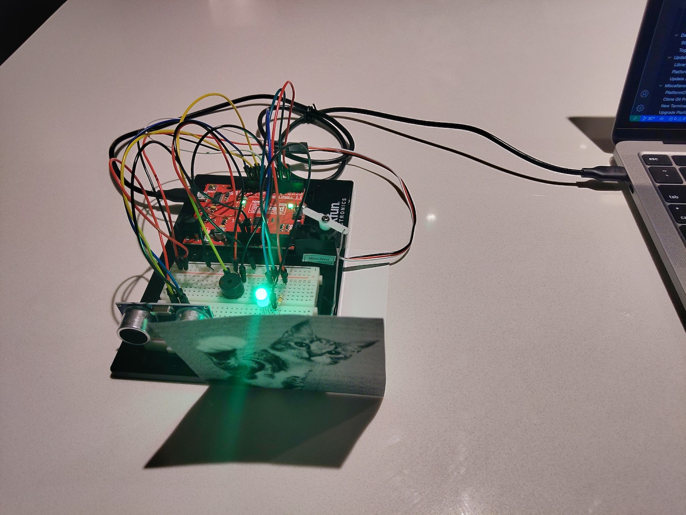

Implementation of circuit 3C from the Sparkfun Inventors Kit (SIK). Their original source code can be found at the [SparkFun Git Repo](https://github.com/sparkfun/SIK-Guide-Code/tree/master/SIK_Circuit_3C-MotionAlarm).
View circuit diagram and instructions at: https://learn.sparkfun.com/tutorials/sparkfun-inventors-kit-experiment-guide---v41/circuit-3c-motion-alarm

The setup for the experiments:
* Distance Sensor positive to 5v
* Distance Sensor negative to ground 
* Distance Sensor trigger analog 11 (A11)
* Distance Sensor echo to analog 12 (A12)
* RGB LED red to 350 ohm resistor to analog 3 (A3)
* RGB LED green to 350 ohm resistor to analog 5 (A5)
* RGB LED blue to 350 ohm resistor to analog 6 (A6)
* RFB LED negative to ground
* Servo positive to 5V
* Servo negative to ground
* Servo signal to PWM analog 9 (A9)
* Buzzer negative to ground
* Buzzer positive to PWM analog 10 (A10)

![Wiring Photo][1]

[1]: doc/3C_Wiring.jpg "3C Circuit Wiring"

### Default
The sparkfun code was downloaded and tested. No significant modifications were required for PlatformIO.

### Experiment 1
Changes to the distances which triggers the motion alarm.

### Experiment 2
Change the motion of the servo. (both Experiment 1 and Experiment 2 can be defined at the same time)

