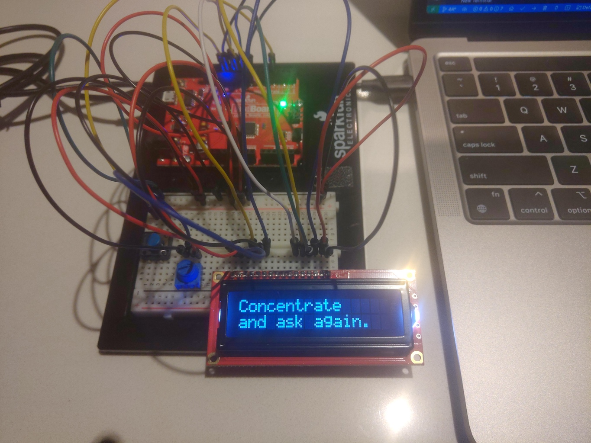

Implementation of circuit 2A from the Sparkfun Inventors Kit (SIK). Their original source code can be found at the [SparkFun Git Repo](https://github.com/sparkfun/SIK-Guide-Code/tree/master/SIK_Circuit_4A-LCDHelloWorld).
View circuit diagram and instructions at: https://learn.sparkfun.com/tutorials/sparkfun-inventors-kit-experiment-guide---v41/circuit-4a-lcd-hello-world

The setup for the experiments (including the button for experiment 4):
* LCD pin 1 to ground
* LCD pin 2 to 5V 
* LCD pin 3 to potentiometer middle pin
* LCD pin 4 to digital pin 13 
* LCD pin 5 to ground
* LCD pin 6 to digital pin 12
* LCD pin 7 to 10 are not used
* LCD pin 11 to digital pin 11
* LCD pin 12 to digital pin 10
* LCD pin 13 to digital pin 9
* LCD pin 14 to digital pin 8
* LCD pin 15 to 5v
* LCD pin 16 to ground
* Potentiometer pin 1 to ground
* Potentiometer pin 3 to 5v
* Button pin 1 to ground
* Button pin 2 to digital pin 4

![Wiring Photo][1]

[1]: doc/4A_Wiring.jpg "4A Circuit Wiring"

### Default
The sparkfun code was downloaded and tested. No significant modifications were required for PlatformIO.

### Experiment 1
Changed the message from "Hello World" to "Time since reset" and displays the seconds justified right with the "s" added.

### Experiment 2
Same as experiment 2, except the time is formatted as HH:MM:SS since last reset.

### Experiment 3
The original experiment (challenge) from SparkFun was to count the number of clicks of a button press. However, this included a button, but a Magic 8-Ball was created. ([See Wikipedia](https://en.wikipedia.org/wiki/Magic_8-Ball)) The button is press and a message will appear for the question asked. The time it takes to display the answer changes randomly.

**Note:** The start message has been updated since the video.