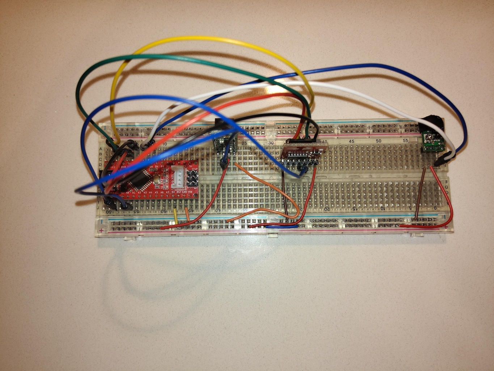
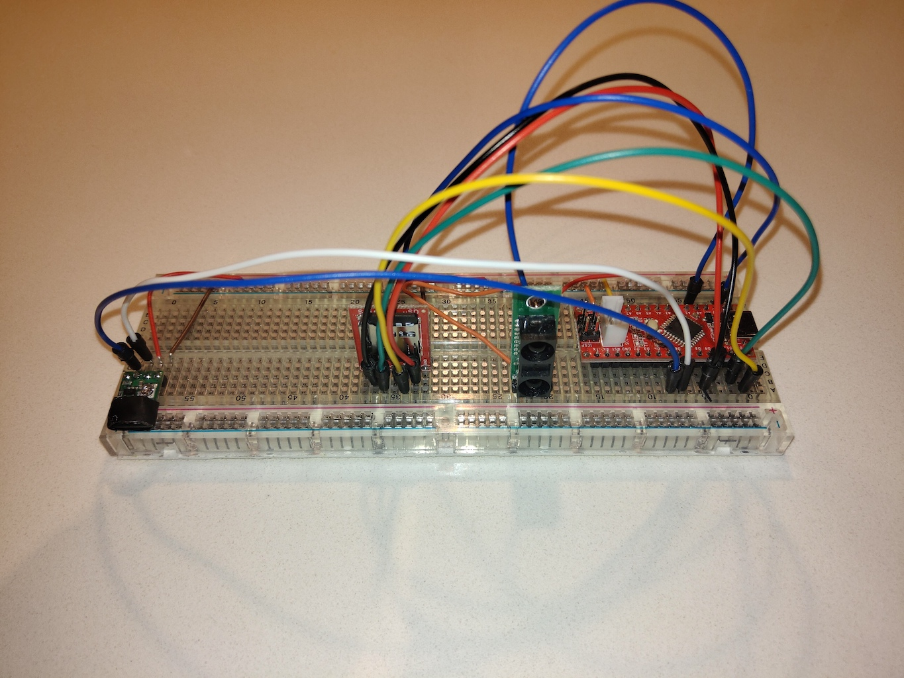
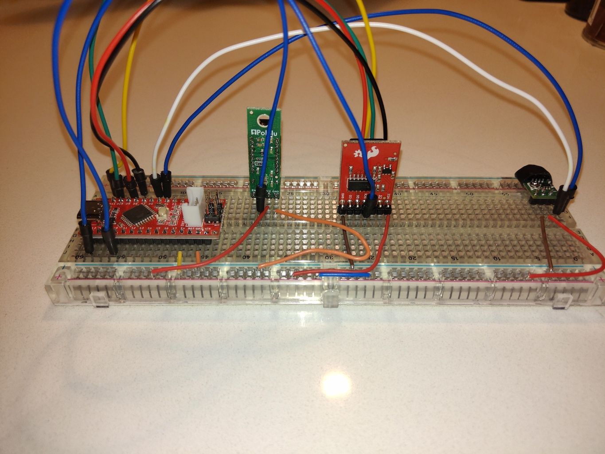
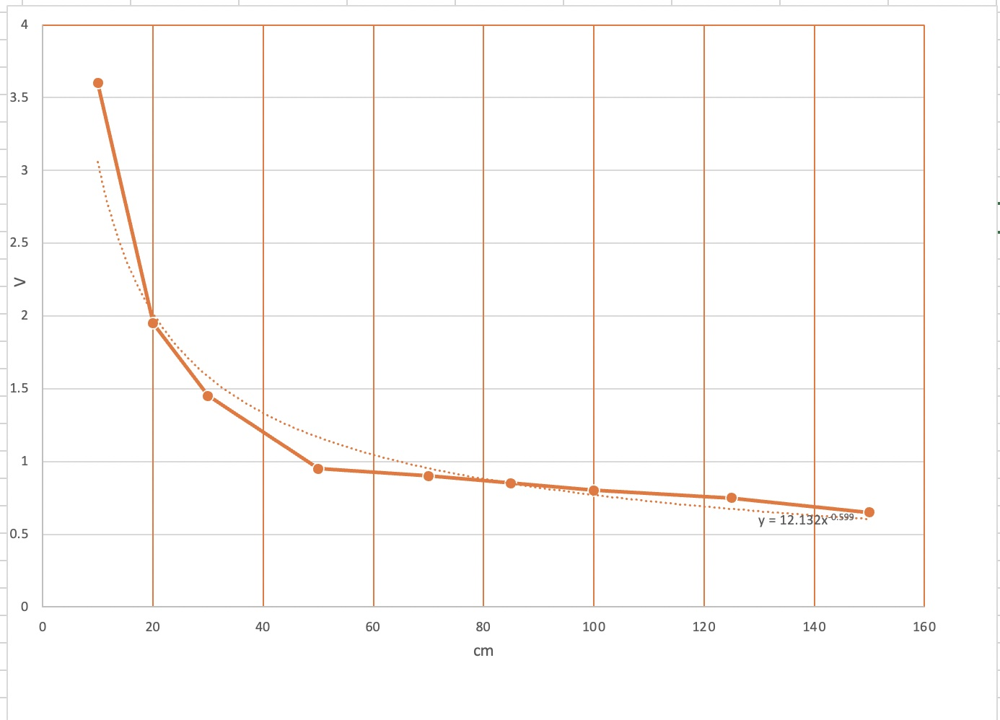
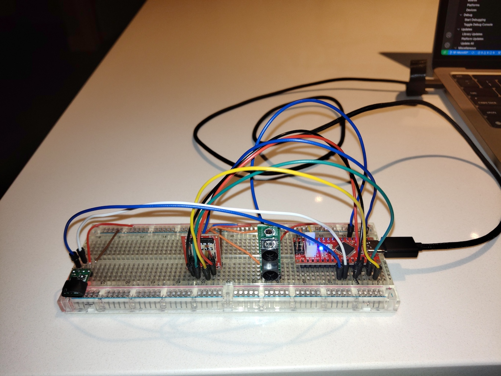

This work is related to experimentation with a MircoSD card and some IR sensors for my [COMP444](https://www.athabascau.ca/syllabi/comp/comp444.html) final project. I am most interested in the SDCard; however, the IR distance and proximity sensors may be incorporated into the final project.

The MicroSD card is a [Sparkfun MicroSD Breakout With Level Shifter](https://learn.sparkfun.com/tutorials/microsd-breakout-with-level-shifter-hookup-guide). The hook-up was based on the previous link and the original code was first used to test the card. It was subsequently modified to test overwriting a file, maintaining a run count, and logging sensor data. 

The Wiring is in the following photos:

The IR distance sensor documentation provided a graph showing voltage vs. distance. I had used Excel to calculate a formula which could be used for conversions in the code. Its not a perfect fit, but seems good enough.

Click the image below to for the video.

