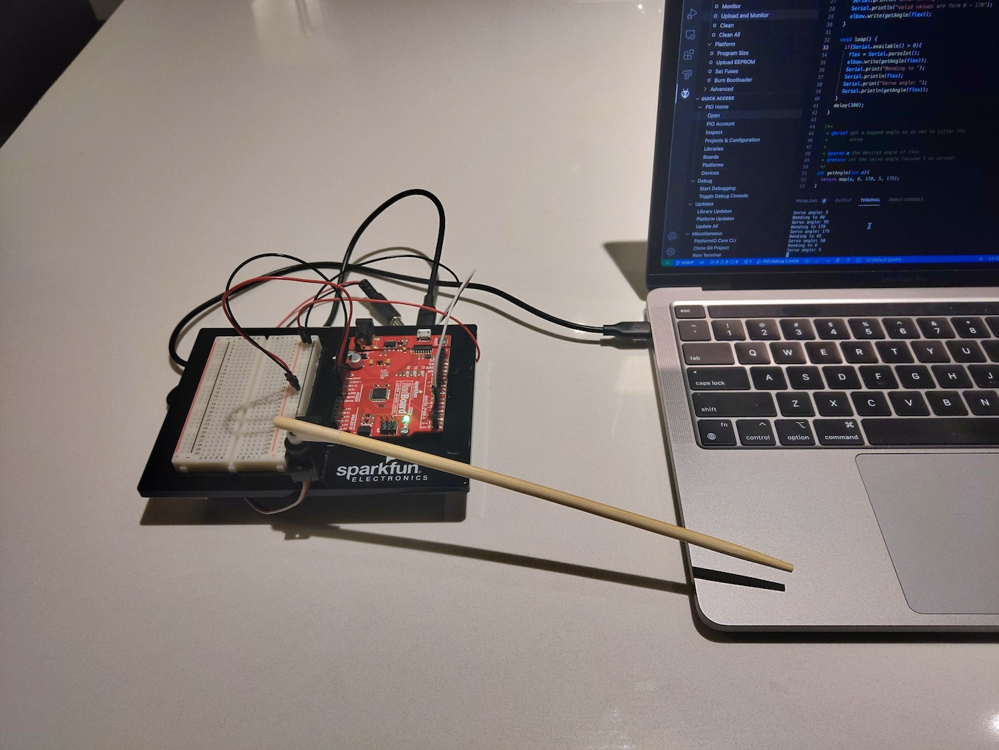

As a part of [COMP444](https://www.athabascau.ca/syllabi/comp/comp444.html), this part relates to unit 3
where we are to emulate an elbow joint. The user inputs the angle for the elbow to flex to from 
0 - 170 degrees, the servo will move to that angle. The actual servo angle is form 5 - 175 degrees to
prevent servo chatter by moving it to the extreme 0 degree angle. 

The setup for the circuit:
* Servo positive to 5V
* Servo negative to ground
* Servo signal to digital PWM 3

![Wiring Photo][1]

[1]: doc/Unit3_Wiring.jpg "Unit 3 Circuit Wiring"

The servo was attached to the platform using the same method as Circuit 3A. The servo program was initially executed and the servo put into the `0` degree position. The single arm attachment was fixed to the servo and the wooden stick taped to the plastic arm. This was adjusted to point as parallel to the board so it could freely swing from `0` to `170` degrees. The arm in the video doesn't look exactly parallel, this is likely due to a combination of the spline on the servo shaft, screw which holds the plastic arm in place, and scotch tape (I was all out of duct tape) being used to attach the wooden stick.

The following video shows the operation of the circuit.

