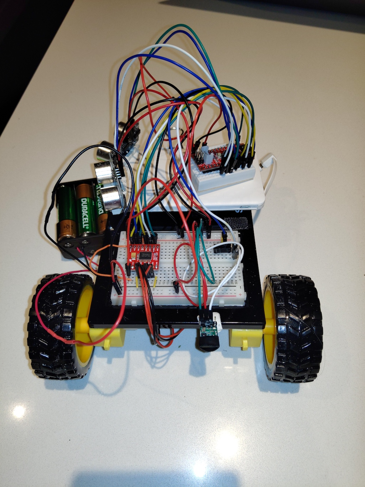

This work is related to experimentation with a robot control for my [COMP444](https://www.athabascau.ca/syllabi/comp/comp444.html) course work. I wanted to incorporate multiple sensors to create a wall following robot. 

The majority of the wiring can be found on the [Sparkfun Circuit 5C autonomous robot](https://learn.sparkfun.com/tutorials/sparkfun-inventors-kit-experiment-guide---v41/circuit-5c-autonomous-robot). The general hookup is the same except for the additional ultrasonic sensor and the IR proximity sensor. I have used a Seeeduino micro controller, but the pin setup is the same as the Sparkfun Redboard. 

The additional HRC-SR4 sensor is on trigger is on digital pin 4 and the echo on digital pin 3. 

The IR out pin is connected to digital pin 2.

The following are photos of the bot:

The link to the video shows the bot. I did have some issues with the flooring and traction with the robot particularly due to the additional weight of the batteries; however, it worked fairly well.

[YouTube Video](https://youtu.be/LNBgIJQcC5c)
